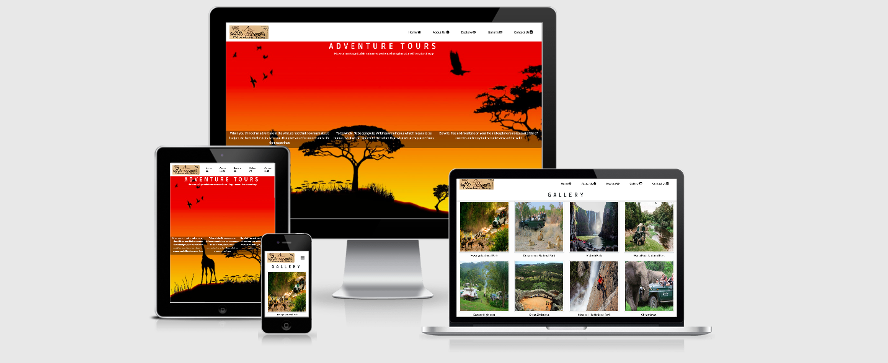
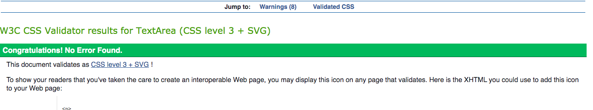

# Adventure Tours

Code Institute - Milestone Project 1

Live Website https://chasakara.github.io/MLS-Project-1-Adventure-Tours/

Github repo https://github.com/chasakara/MLS-Project-1-Adventure-Tours

## Descpriotn 

 Adventure Tours is a static website were it shows tourist the best camping site, hiking sites and one day touring around the country for best value of your
 money

## UX

This website was developed so as to make it easy for for tourists to find best camping site, hiking sites and one day touring around the country for best value of their
money. This website was made so as to let tourists see the best natural places in the country were they can go and relax being away from most human civilasation for be it a day or days 

### Structure

The site is structured as a 5 page website

The landing page features the Adventure Tour logo and a background imgae.

There is a Navigation bar at the top of the site.The Navigation bar collapses on smaller devices and a button appears which gives access to the Nav-Links on smaller devices

Tourist can navigate to each page on the site by clicking the appropriate link within the Navigation bar - The buttons/links are designated by name corresponding to their respective pages

##### Skeleton

Framework https://balsamiq.cloud/siiqo5t/pkr58us

## Features in Use

#### Home page

Landing page meant to grab the user's attention and introduce the type of service one would expect

#### Gallery page 

A media page which showcases pictures of other camping, hiking and touring sites around the country

#### Explore

A page which shows the prices and activities included for camping, hiking or touring around the country

#### User Stories

"As a  tourist l want to see the photos of some the hiking site"

"As a tourist l want to see the the price of the camping site"

"As a tourist looking for an adventure holiday, I wanted to find out what deals were available"

"As a  tourist l want to see the the activities offered on a certain tour"

#### Future Technology 
Tourist will be able to post their videos on the site

Tourist will be able to post their rating 

A map of the cmaping sites will be added

Tourist will be able to search for the type of tour they want based on their budget

Sites with higher rating will be recommended automatically when ever a tourist visits the home page

## Technologies Used
 
HTML5: Modern HTML to form the structure of the site.

CSS3: Used to style the site.

Bootstrap: A front end framework used to simplify the grid system of the site and allow basic JS functionality for the project.

Git: Used for version control from the very beginning of the project.

Github: A remote repository used to store the source code for the project.

Github Pages: GitHub's own hosting service used to deploy the project.

Balsamiq: A wireframe/mockup application that allowed me to create the basic structural design of the project

## Testing 

### Chrome Developer Tools 

Frequent testing was carried out using Chrome’s developer tools to ensure that the content of the site 
behaved properly and looked good across a range of screen sizes. This was also utilised to ensure that
there was sufficient contrast between text and the background colour.

### Testing Process
This website was also tested manually on a range of devices and internet browsers:

##### MacBook Laptop

Google Chrome

Internet Explorer 11

Microsoft Edge

Mozilla Firefox

##### Mobile Samsung Galaxy S10:

Google Chrome

Firefox

Brave

##### iPhone 8:

Safari

Google Chrome

## Validators
##### HTML

W3C HTML Validator

no errors were  found.

##### CSS
W3C CSS Validator

## Manual Tests
Several manual tests were performed to ensure the best possible user experience in both desktop and mobile environments. 

These were the manual tests performed and passed:

All external links open in a new tab

Scrolling is smooth accross all browsers.

There are no console errors.

Navigation never breaks.

Clicking on the logo brings you to home page.

## DEPLOYMENT

#### Local
This project can be ran locally by going to this Repository link and clicking on the Clone or Download button and copying the link provided.

In your IDE, open a Terminal window and change to the directory where you want to clone this project and type Git clone "your copied link".

After pressing Enter the project will be created and cloned locally.

Alternatively you can download the zipped file, decompress it and use your IDE of choice to access it.

#### Remote

#### The method used to deploy this website was as follows:

• In GitHub, navigated to my repository.

• Under my repository, clicked "Settings".

• Under the "GitHub Pages" section, used the Source drop-down menu and selected a publishing source, in this case the Master Branch.

• The website was immediately published and a green tab appeared with a link to the live website.

• The link obtained is the one displaying at the top of this document.

## Credits

### Media
The photos and quotes used in this site were taken from google search

## Acknowledgements
Precious_Mentor, mentor.

code-institute-room.slack.com. 

